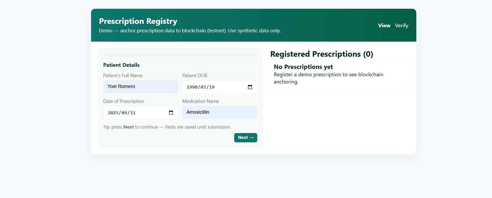
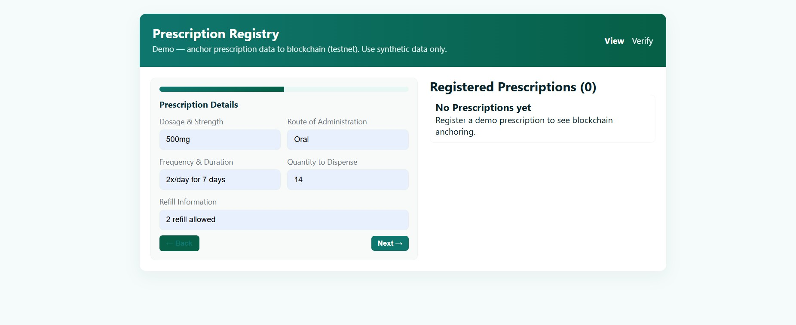
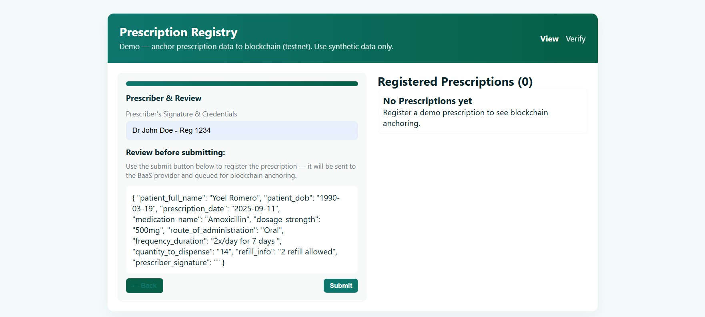
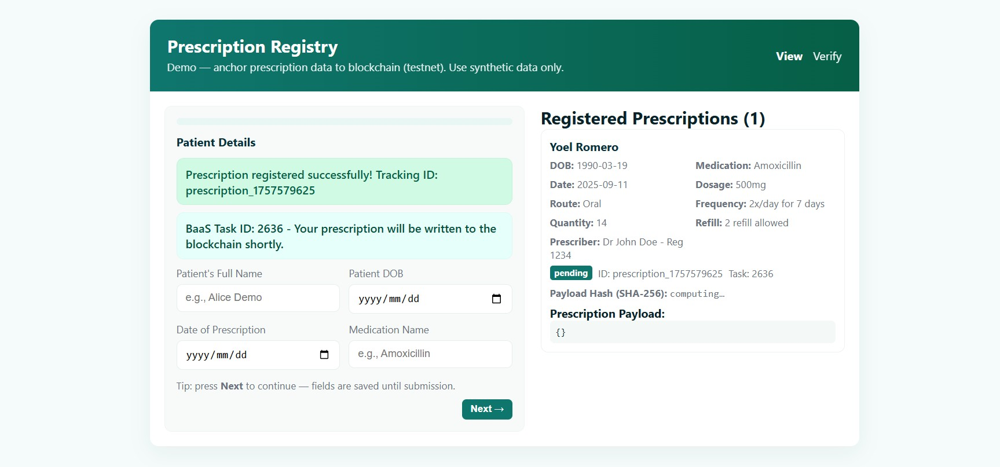
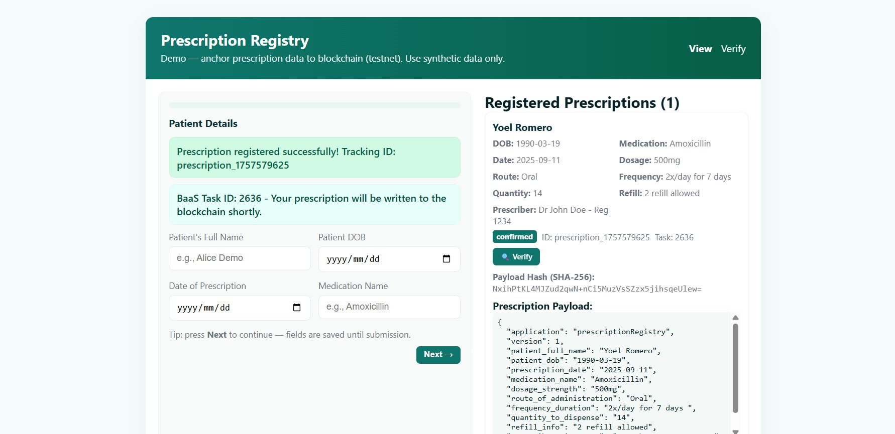
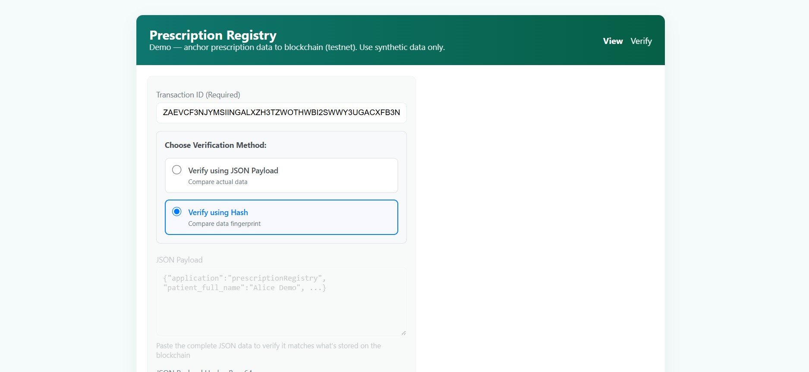
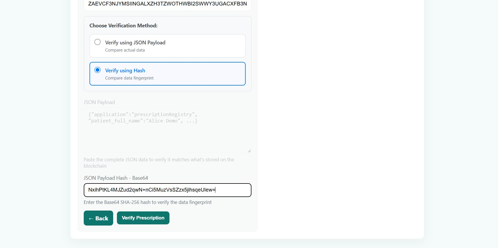
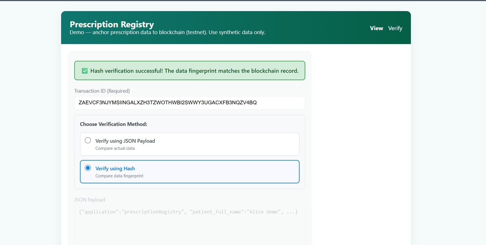
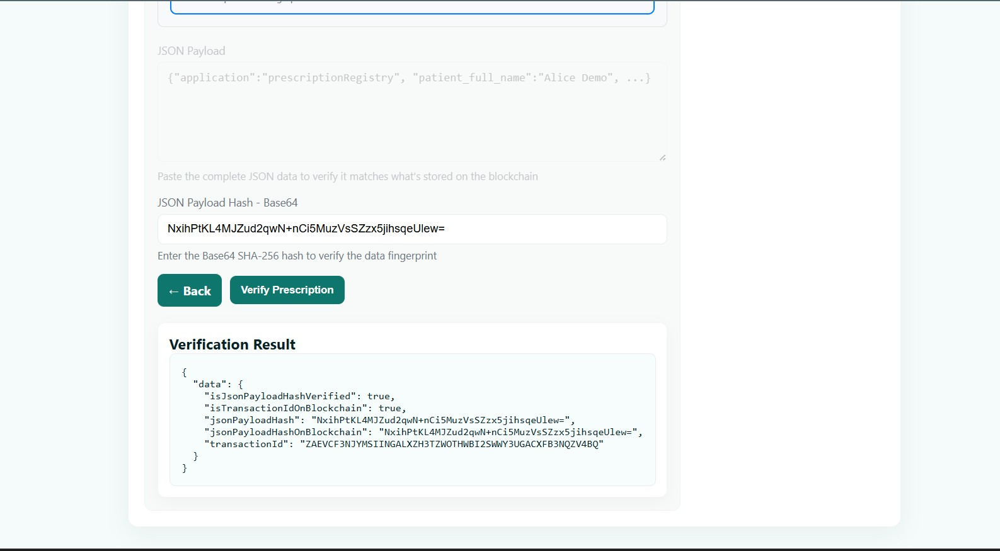

# Medical Prescription Registry v1 - BaaS Integration

A Flask web application that demonstrates how medical prescription data can be anchored on the Algorand blockchain through a Blockchain-as-a-Service (BaaS) platform. Features asynchronous processing and webhook notifications!

## How It Works

This v1 approach uses BaaS (Blockchain as a Service) integration:
- Sends **JSON payloads** with prescription records to BlockAPI BaaS platform
- Receives **immediate confirmation** and queues for blockchain processing
- Gets **webhook notifications** when blockchain write completes
- Provides **asynchronous, scalable** blockchain integration
- Supports **transaction verification** by transaction ID

## Quick Start

### Prerequisites
- Python 3.7+

### Setup

1. **Clone and install dependencies:**
```bash
git clone https://github.com/edzaniBruce51/algorand-prescription-registry-v1.git
cd algorand-prescription-registry-v1
pip install -r requirements.txt
```

2. **Configure environment:**
  FLASK_SECRET_KEY=your_flask_secret
  BLOCKAPI_BASE_URL=https://blockapi.co.za/api/v1
  BLOCKAPI_API_KEY=your_api_key_here
  WEBHOOK_URL=https://your-service.onrender.com/webhook/prescription-notification

3. **Run the app:**
```bash
python app.py
```

Visit `http://127.0.0.1:5000` to register and view songs.

## Features

- **No wallet setup required** ((BaaS handles blockchain access)
- **Asynchronous writes** with webhooks for transaction confirmation
- **Public verification** via Algorand Explorer (transaction ID stored)
- **Prescription metadata registry** - (prescription patients full names & Date of birth, Date of Prescription, Medication Name, Dosage & Strength, Route...)
- **Flash messages** show success/errors in UI

## Example Payload Sent to Baas
{
  "dataSchemaName": "prescriptionRegistry",
  "dataId": "presc_1724209000",
  "jsonPayload": {
    "application": "prescriptionRegistry",
    "version": 1,
    "patient_full_name": "Alice Demo",
    "patient_dob": "1990-01-01",
    "prescription_date": "2025-09-04",
    "medication_name": "Amoxicillin",
    "dosage_strength": "500mg",
    "route": "oral",
    "frequency_duration": "2x/day for 7 days",
    "quantity": "14",
    "refill_info": "None",
    "prescriber_signature": "Dr Demo - Reg 0000",
    "timestamp": "2025-09-04T08:00:00Z"
  }
}

## Workflow

### Step 1: Patient Details Entry

*Enter patient's full name, date of birth, prescription date, and medication name*

### Step 2: Prescription Details

*Add dosage & strength, route of administration, frequency & duration, quantity to dispense, and refill information*

### Step 3: Prescriber & Review

*Add prescriber's signature & credentials, then review all prescription details before submission*

### Step 4: Prescription Registration Success (Pending)

*Prescription is registered successfully with a tracking ID and BaaS Task ID. Status shows as "pending" while blockchain processing occurs*

### Step 5: Blockchain Confirmation Complete

*Prescription status changes to "confirmed" with payload hash and full prescription details displayed*

### Step 6: Verification Interface

*Access the verification page by entering the transaction ID. Choose between JSON payload verification or hash verification methods*

### Step 7: Hash Verification Method

*Select "Verify using Hash" option and enter the Base64 SHA-256 hash to verify the data fingerprint*

### Step 8: Hash Verification Process

*Paste the complete JSON data and enter the hash value for verification*

### Step 9: Successful Verification Result

*System confirms successful hash verification with detailed verification results showing the data integrity match*

## Live Demo

🌐 **Try the live application:** https://algorand-prescription-registry-v1.onrender.com

## Tech Stack

- **Frontend:** HTML, Flash Messages 
- **Blockchain:** Flask (Python)
- **Data Storage:** In-memory (prescriptions list; not persistent)
- **Blockchain:** Algorand (via BlockAPI Baas)
- **Deployment:** Render

## Architecture Benefits

✅ **Simplified Development** - No smart contract deployment or maintenance, BaaS handles complexity
✅ **Webhook-driven** - updates -> async & scalable
✅ **Transparent** - Transaction IDs verifiable on Algorand Explorer
✅ **No private keys** - no risk of wallet exposure 

## Business Value

Perfect for demonstrating blockchain use in healthcare without the complexity of full blockchain development:
- Immutable proof of prescription issuance & timestamping
- Public verification capabilities
- Minimal technical overhead
- Clear demonstration of blockchain in healthcare potential